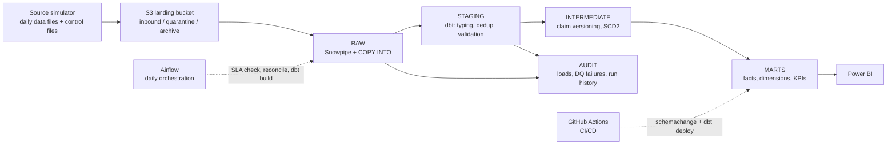

# Architecture v1

PROD data flow. DEV and TEST have the same shape with their own bucket,
database, warehouse and roles (see ADR-001).

```mermaid
flowchart LR
  SIM["Source simulator<br/>daily data files + control files"]
  S3["S3 landing bucket<br/>inbound / quarantine / archive"]
  RAW["RAW<br/>Snowpipe + COPY INTO"]
  STG["STAGING<br/>dbt: typing, dedup, validation"]
  INT["INTERMEDIATE<br/>claim versioning, SCD2"]
  MART["MARTS<br/>facts, dimensions, KPIs"]
  AUD["AUDIT<br/>loads, DQ failures, run history"]
  BI["Power BI"]
  AF["Airflow<br/>daily orchestration"]
  GH["GitHub Actions<br/>CI/CD"]

  SIM --> S3 --> RAW --> STG --> INT --> MART --> BI
  RAW --> AUD
  STG --> AUD
  AF -. "SLA check, reconcile, dbt build" .-> RAW
  GH -. "schemachange + dbt deploy" .-> MART
```